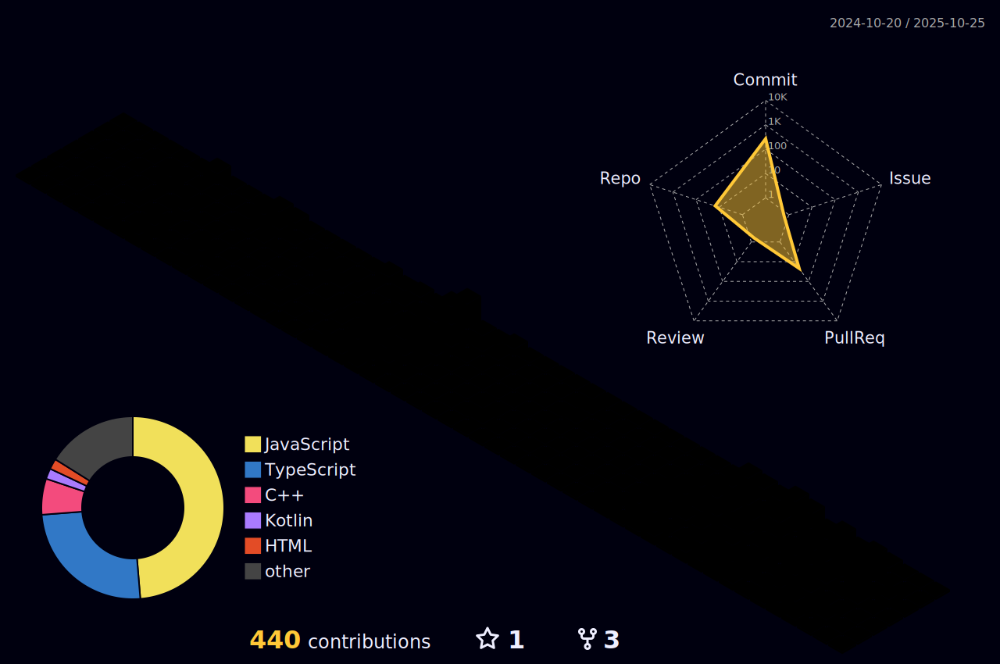

  

    

    

 

<pre>

    <b>I'm into Web Development, Problem Solving and Android UI Development.</b> 
    <b>Know about me:        <a href="https://evasabeeh.github.io/" target="_blank" rel="noopener noreferrer">Portfolio</a></b>
    <b>Check Out My Resume:  <a href="https://drive.google.com/file/d/1bl4uwfV8MdEZQ8FeSAEiLNzOOcW1i6xC/view?usp=drive_link" target="_blank" rel="noopener noreferrer">Resume</a></b>
    <b>Let's connect:        <a href="https://www.linkedin.com/in/evasabeeh/" target="_blank" rel="noopener noreferrer">LinkedIn</a></b> 
    <b>Mail me:              <a href="mailto:evasabeeh@gmail.com" target="_blank" rel="noopener noreferrer">Mail</a></b>

</pre>

 

    

 
 

    

 

 

 

 

 
 

    

 
 
 
 
 

 

 
 
 
 

 

 
 

    

 
 
 
 

 

 

 

<!--img align="center" src="/github-metrics.svg" alt="Metrics" width="100%"-->

 

    

 

    

